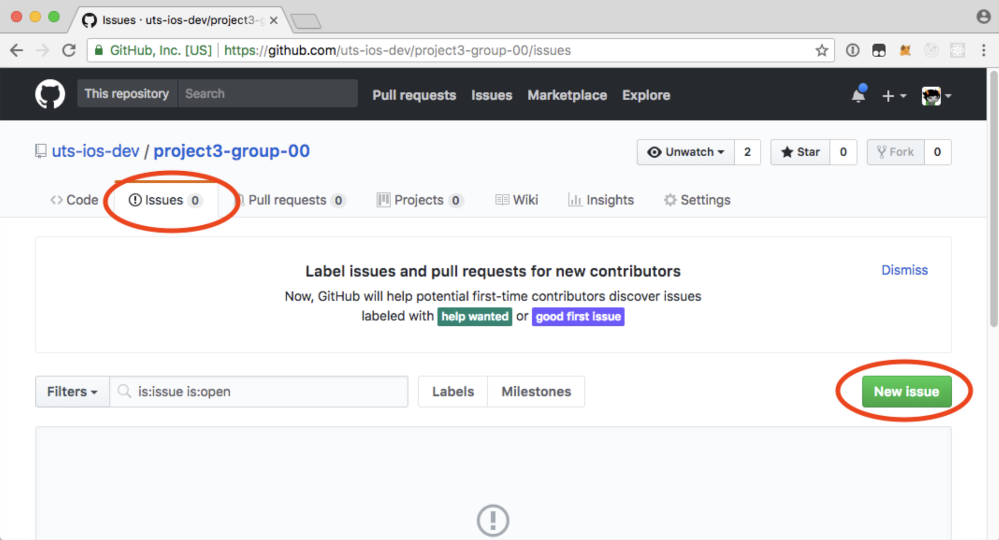

Faculty of Engineering and Information Technology School of Software

41889 - Application Development in the iOS Environment 42889 - iOS Application Development Autumn 2019

# Assessment Task 3

Group project: Design and develop an application

Due the week of 3 June 2019, in your tutorial

This project is worth 30% of the overall mark for this subject.

## Introduction

You will create an application that solves a real-world problem for a fictional user persona. You will follow an iterative product design cycle to produce a minimum viable product. On the final day of class you will demonstrate the product to fictional investors in a 15-minute presentation.

## Requirements

1. You shall work in a group of three or four members, assigned by your lab tutor.
2. You shall create a source code repository using GitHub Classroom.
   Use this invitation link: https://classroom.github.com/g/oC2ZetEy
   and create a group named Group-### where ### is your assigned group number.
   - Each group member is expected to commit some code, documentation, or other assets to this repository.
3. You shall follow the Product Design cycle, iteratively planning, prototyping, and testing more detailed versions of your app.
4. You shall demonstrate your application in a 15-minute presentation, explaining who would use it and what problem it solves.

## Schedule

| Week        | Lab Activity                                                     | Homework                                                     |
| ----------- | ---------------------------------------------------------------- | ------------------------------------------------------------ |
| 13&nbsp;May | Form groups and select a topic. Sketch your app's workflow. | Implement a wireframe prototype in Xcode.                    |
| 20&nbsp;May | Demonstrate your prototype to another group.                     | Refine the workflow, and begin implementing functionality.   |
| 27&nbsp;May | Quiz 3 Peer assessment and code review                      | Implement a Minimum Viable Product and prepare presentations |
| 3&nbsp;June | Final Presentations                                              |                                                              |

## Assessment

10 marks: Peer assessment of your groupwork and peer review of your code design

10 marks: Final presentation

10 marks: Submitted code on GitHub

#### Late submission

Because of the group nature of this project and the semester teaching schedule, **no** extensions or special consideration will be considered. The due date is final.

## Suggested Topics

Each group is encouraged to come up with their own app idea. If your group is unable to decide what to develop, select a topic from the suggestions below.

- Design and implement a crypto-currency wallet application that can hold a minimum of three currencies. The application doesn't require the implementation of a backend-server to manage wallets. The design should be visually appealing. (For example: [Huobi Wallet](https://itunes.apple.com/us/app/huobi-wallet-safe-reliable/id1433883012?mt=8))
- Create an application that makes it easy for a user to view and manage their crypto-currencies. Data should be presented to the user in a meaningful and appealing way. Information such as today's loss and gain should be implemented. Inspiration can be drawn from the default [iOS stock app](https://itunes.apple.com/us/app/stocks/id1069512882?mt=8) or other crypto apps such as [Blockfolio](https://itunes.apple.com/us/app/blockfolio-bitcoin-altcoin/id1095564685).
- Show off features of a Cocoa Touch framework such as <a href="https://developer.apple.com/documentation/arkit">ARKit</a>, <a href="https://developer.apple.com/documentation/avkit">AVKit</a>, <a href="https://developer.apple.com/documentation/coredata">Core Data</a>, [Core ML](https://developer.apple.com/documentation/coreml), <a href="https://developer.apple.com/documentation/healthkit">HealthKit</a>, <a href="https://developer.apple.com/documentation/homekit">HomeKit</a>, <a href="https://developer.apple.com/documentation/mapkit">MapKit</a>, <a href="https://developer.apple.com/documentation/pushkit">PushKit</a>, <a href="https://developer.apple.com/researchkit/">ResearchKit</a>, <a href="https://developer.apple.com/documentation/scenekit">SceneKit</a>, <a href="https://developer.apple.com/documentation/spritekit">SpriteKit</a>, <a href="https://developer.apple.com/documentation/gamekit">GameKit</a>, or <a href="https://developer.apple.com/documentation/documentation/webkit">WebKit</a>.
  See the list of frameworks at [https://developer.apple.com/documentation/](https://developer.apple.com/documentation/)
- Show off features of a third-party framework such as [Alamofire](https://github.com/Alamofire/Alamofire), [Masonry](https://github.com/SnapKit/Masonry), or [Firebase](https://firebase.google.com/).
  See popular frameworks at [https://trendingcocoapods.github.io/](https://trendingcocoapods.github.io/)

## Academic Honesty Policy

You will be assessed on your ability to skillfully integrate existing frameworks and libraries to solve novel problems. You may use code from external sources as long as you **cite the source** in a comment or Podfile.

---

## Week of 13&nbsp;May

### Form Groups

Arrange groups of 3-4 team members who will develop an application together.

### Brainstorm an application to develop

1. Come up with an idea for an application that solves a real problem for a fictional persona.

2. Use the **Product Design Worksheet** to sketch a workflow for using this app, showing various scenes and the segues between them.

3. Before next week's lab, implement this workflow as a storyboard in Xcode.

---

## Week of 20 May

### Prototype your app workflow in Interface Builder

Place the essential scenes, buttons, and segues to navigate through your app, and get it running in a Simulator or on a device.

### Demonstrate your prototype to another group

1. Invite someone from another group to use your prototype.

2. Tell them what they are trying to use the app for.
   For example: "You are using this app to figure out what recipes you can cook with the ingredients in your kitchen."

3. Do not tell them how to use the app.  
   Watch and take notes about what they try first, without instructions.

4. Identify issues with your workflow, and record them in GitHub.  
   (You can do this even if you have not yet uploaded any code.)

   A good issue describes the action that was taken, the expected result, and the observed result.

5. Volunteer to test another group's prototype.

6. Before next week, write some code so that you can participate in the code review exercise.

---

## Week of 28 May

#### Code Review Exercise

See **Lab 9 Agenda**

#### Peer Groupwork Assessment

See **Peer Assessment Worksheet**

### Minimum Viable Product

Decide what functionality you want to include in your final app. This may be larger or smaller than your original design.

To get an idea of which features are on the critical path, ask someone from another group to use your app, and write down which features they try to use without being instructed.

### Final Presentation Outline

Write an outline of your presentation. Decide how many minutes you will spend on each topic or feature.

---

## Week of 3 June

You will have 5 minutes to set up, and up to 15 minutes to present your application. Each team member must participate in the presentation.

A good presentation should:

- **Describe the target audience** for this app.
- **Explain what problem is being solved**, and how this app compares to other possible solutions.
- **Show the app being used**. Decide whether you want to use a simulator or device, or record a video. You can display a device's screen using QuickTime Player. It is also possible to use a HDMI cable or the lectern document camera.

Depending on the nature of your app, you may also want to discuss:

- What **business model** this app supports.
- What **frameworks** or services you used to implement it.
- How your design and development **process** worked, and whether you felt it was effective.

At least one presenter should be prepared to answer questions about technical details.

You are allowed to use slides, but they are not required.
